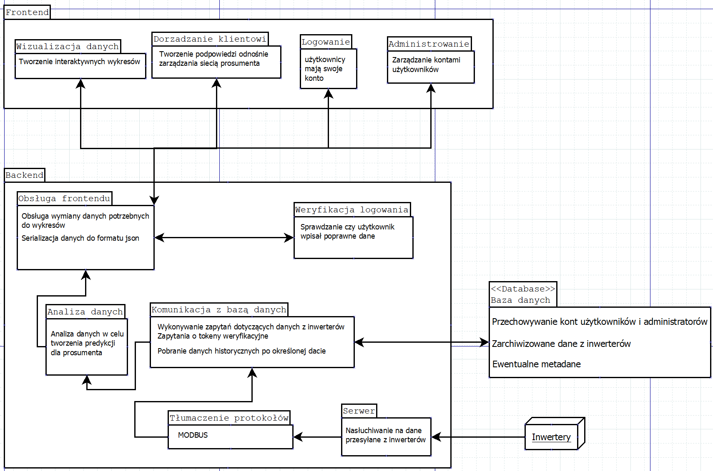

# Prosument

Projekt "Prosument" realizowany w ramach PZSP2 na WEiTI PW
## Cel projektu
Celem projektu jest utworzenie sieciowej aplikacji do wizualizacji danych opisujących gospodarkę energetyczną
u klientów. Na prośbę klienta położyliśmy szczególny nacisk na biznesowy aspekt, czyli sprawiliśmy, aby program
był przygotowany na realne zastosowanie w przemyśle.
Dane zbierane są po stronie klienta przez specjalne urządzenia znane jako ”inwertery”, do których podłączone
są urządzenia, z których korzysta klient. Dalej są one wysyłane na serwer, skąd trafiają do bazy danych, z której
mogą być odzyskane przez klienta.

## Użyte technologie

<p align="center">
  <a href="https://skillicons.dev">
    
  </a>
</p>

Frontend
* Javascript
* React.js

Backend
* Java
* Spring Boot

Database:
* MySQL

## Instalacja

Aby poprawnie zainstalować projekt po pobraniu go z repozytorium należy użyć pliku pom.xml, ponieważ zostały wykorzystany maven.
Baza danych obecnie jest postawiona na serwerze bigubu, aby z niej skorzystać należy ustawić odpowiednie tunelowanie. Docelowy zamysł aplikajci był taki, aby była ona hostowana na tym samym serwerze co baza danych i z tego powodu tunelowanie nie jest automatyczne.

```bash
ssh -L 3306:172.21.161.2:3306 login@bigubu.ii.pw.edu.pl
```
Następnie, aby postawić część frontend'ową aplikacji należy wejść do folderu /frontend/app i napisać:
```bash
npm install
npm start
```

## Jak korzystać z aplikacji

Aplikacja jest intuicyjna, a sposób jej wykorzystania jest lepiej wykorzystany w dokumentacji.

## Wnętrze aplikacji
UWAGA TEN DIAGRAM JEST NIEAKTUALNY, AKTUALNY DIAGRAM ZNAJDUJE SIĘ W DOKUMENTACJI FINALNEJ.


